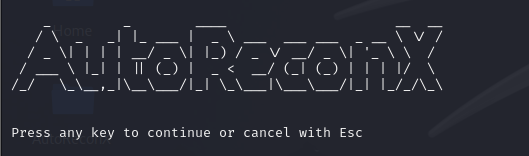
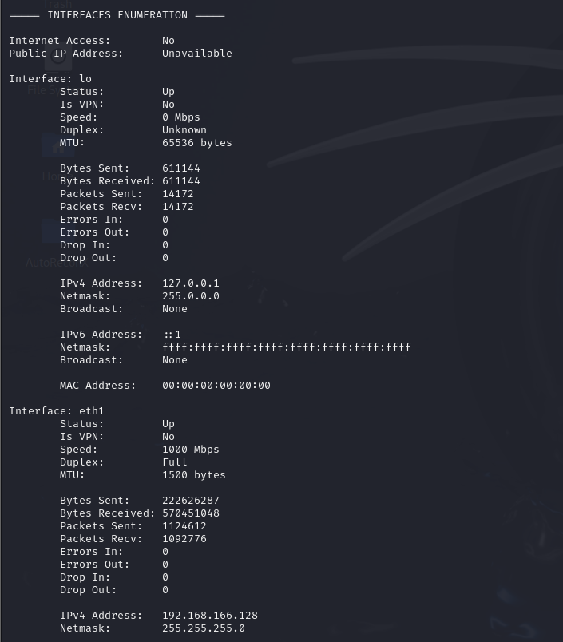

<p align="center"></p>

## About AutoReconX

Automation Tool for Pentesting

## Authors
- Leandro Panesso Atehortúa
- Jhon Alejandro Piraquive Ramírez

## Installation Instructions

These instructions are specific to Debian-based Linux distributions (e.g., Ubuntu, Debian).

Ensure you have the following requirements:

- sudo privileges to execute the installation and run commands.
- Python 3 is required.

### Install with Docker

Follow this steps if you're planning to install with docker these scripts

- Clone the repository or download the files
- Navigate to the software folder
- Execute:
```console
# docker compose up -d --build
```
- Wait until the contaner is up and running

### Install Manually

Follow this steps if you're planning to install manually these scripts 

- Clone the repository or download the files
- Navigate to the software folder
- elevate privileges to root
- Execute:
```console
# . ./install
```

### How to execute

Execute the following comand to start the scripts

```console
# . ./run
```

### User Guide

Our software is created to automate those boring process that every pentester should do, in order to make this more funny and easier for our people we handle everything with just one bash once you execute the bash you'll go through some steps that you can continue by pressing any key except (Esc) only to let you quit the software 😂

Execute the software:

<p align="center"></p>

Welcome View:

<p align="center"></p>

By pressing any key you'll continue step by step our software

1. System Information
    <p> In this step you'll find all your system information </p>
    <p align="center"></p>

2. Interfaces Information
    <p> In this step you'll find all your interfaces information </p>
    <p align="center"></p>

3. Firewall Information
    <p> In this step you'll find any information related to firewalls </p>
    <p align="center"></p>

4. Network Hosts Information
    <p> In this step you'll find any information related to any host connected to your network </p>
    <p align="center"></p>

4. Public Files Enumeration
    <p> In this step you'll find any information related to files or folders accesible for hosts that have an http or https service running; Don't hesitate this could take a while depending on how many hosts are in your network</p>
    <p align="center"></p>